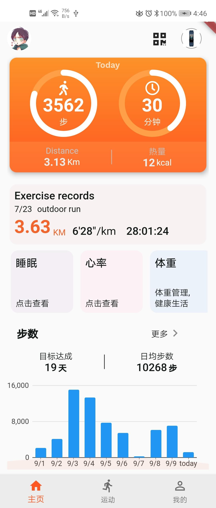
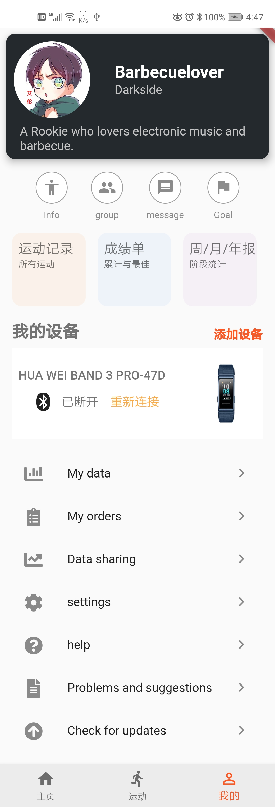
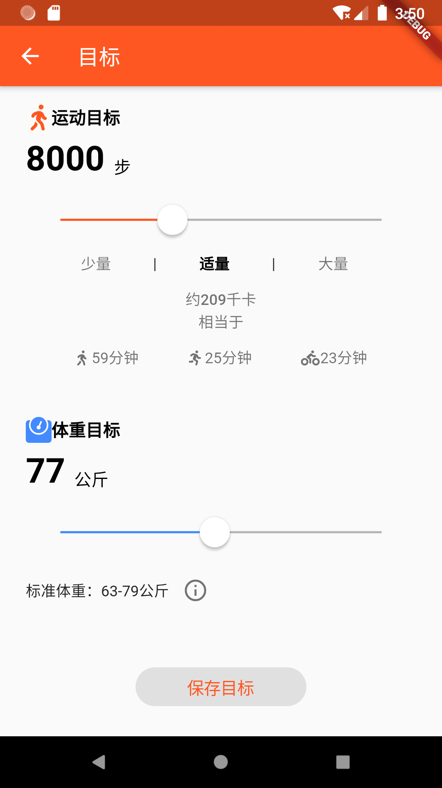
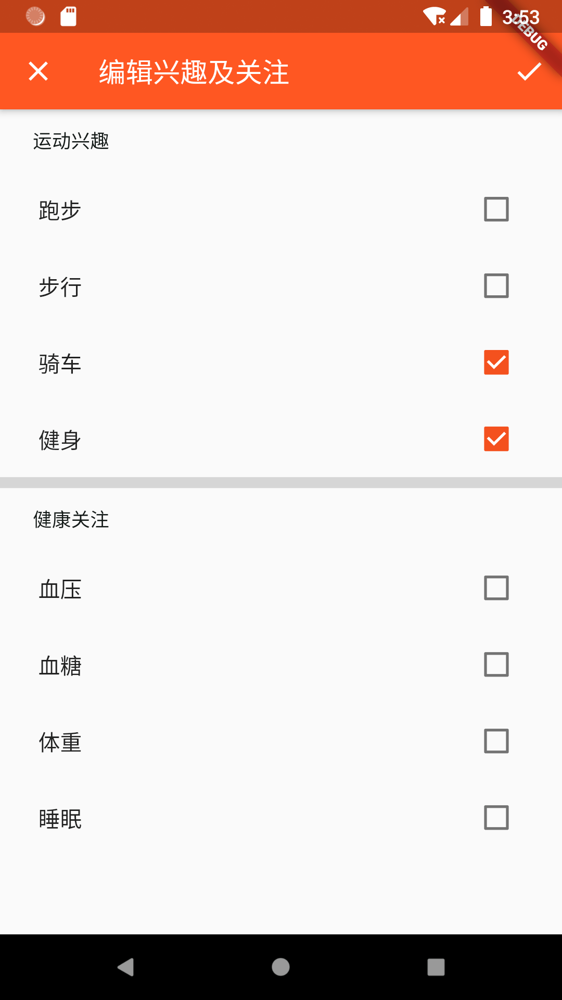
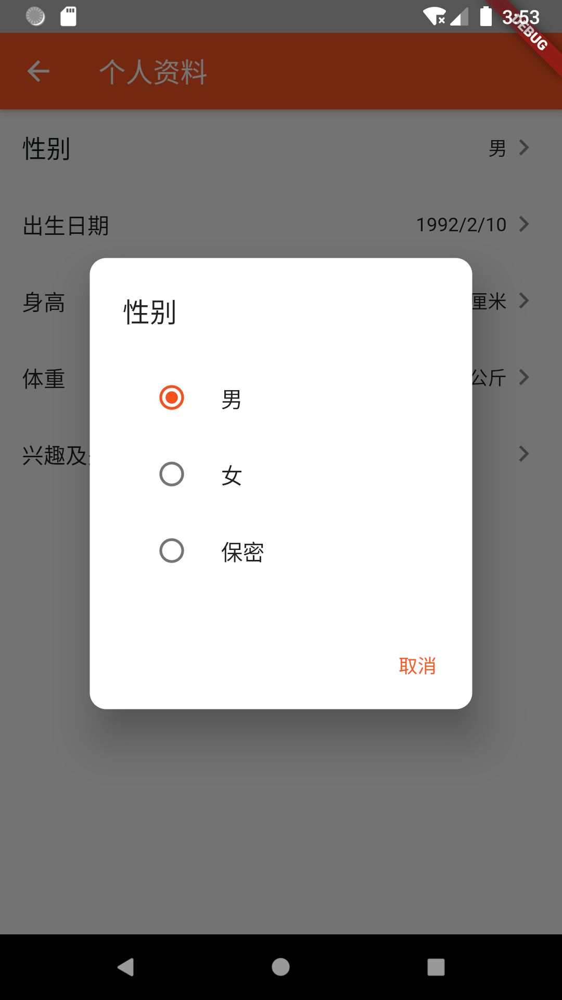
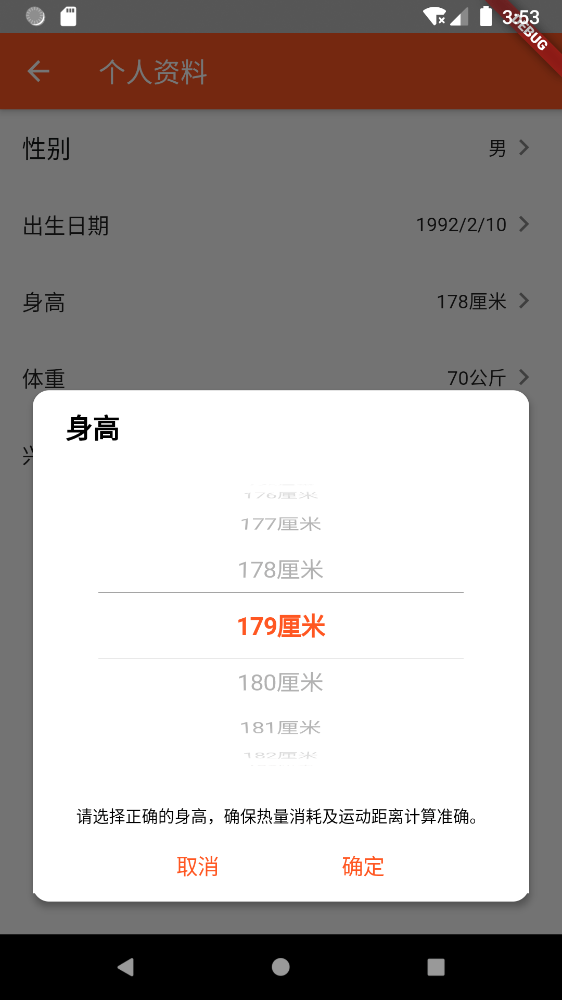
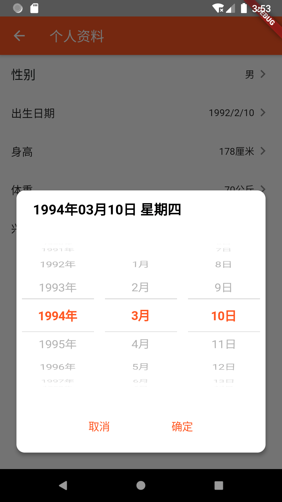

# flutter_fit

一个运动手环应用（UI仿华为健康）。只是有UI，没有和手环设备交互功能（不知道华为手环BLE协议,功能是无法做的）。

做此项目目的：初入flutter，熟悉各种Widget属性和常用package。

## 界面效果 
**部分为滚动截图:**
 

 

 

#### 用到的package

- [条形图   charts_flutter: ^0.6.0](https://github.com/google/charts)

- [路由框架  fluro: ^1.5.1 ](https://github.com/theyakka/fluro)

- [日期滚轮选择器 基于flutter_datetime_picker: 1.2.6 做了修改](https://github.com/Realank/flutter_datetime_picker)

## Getting Started

This project is a starting point for a Flutter application.

A few resources to get you started if this is your first Flutter project:

- [Lab: Write your first Flutter app](https://flutter.io/docs/get-started/codelab)
- [Cookbook: Useful Flutter samples](https://flutter.io/docs/cookbook)

For help getting started with Flutter, view our 
[online documentation](https://flutter.io/docs), which offers tutorials, 
samples, guidance on mobile development, and a full API reference.
